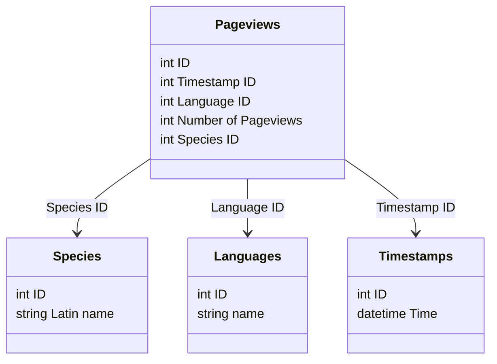

```mermaid
classDiagram
  class Species{
        int  ID
        string Latin name
    }
  class Languages{
        int ID
        string name
    }
  class Pageviews{
        int ID
        int Timestamp ID
        int Language ID
        int Number of Pageviews
        int Species ID
    }
  class Timestamps{
        int ID
        datetime Time
    }
    %% Relationships (foreign keys)
    Pageviews --> Species : Species ID
    Pageviews --> Languages : Language ID
    Pageviews --> Timestamps : Timestamp ID

```
