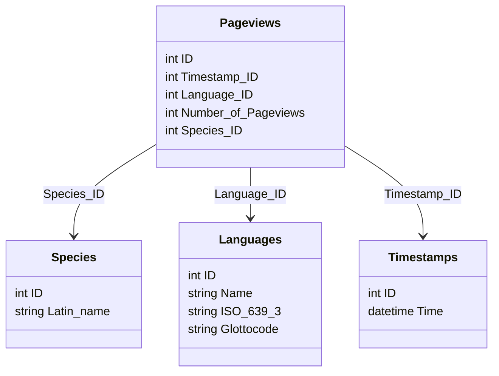

```mermaid
classDiagram
  class Species{
        int  ID
        string Latin_name
    }
  class Languages{
        int ID
        string Name
        string ISO_639_3
        string Glottocode
    }
  class Pageviews{
        int ID
        int Timestamp_ID
        int Language_ID
        int Number_of_Pageviews
        int Species_ID
    }
  class Timestamps{
        int ID
        datetime Time
    }
    %% Relationships (foreign keys)
    Pageviews --> Species : Species_ID
    Pageviews --> Languages : Language_ID
    Pageviews --> Timestamps : Timestamp_ID

```
