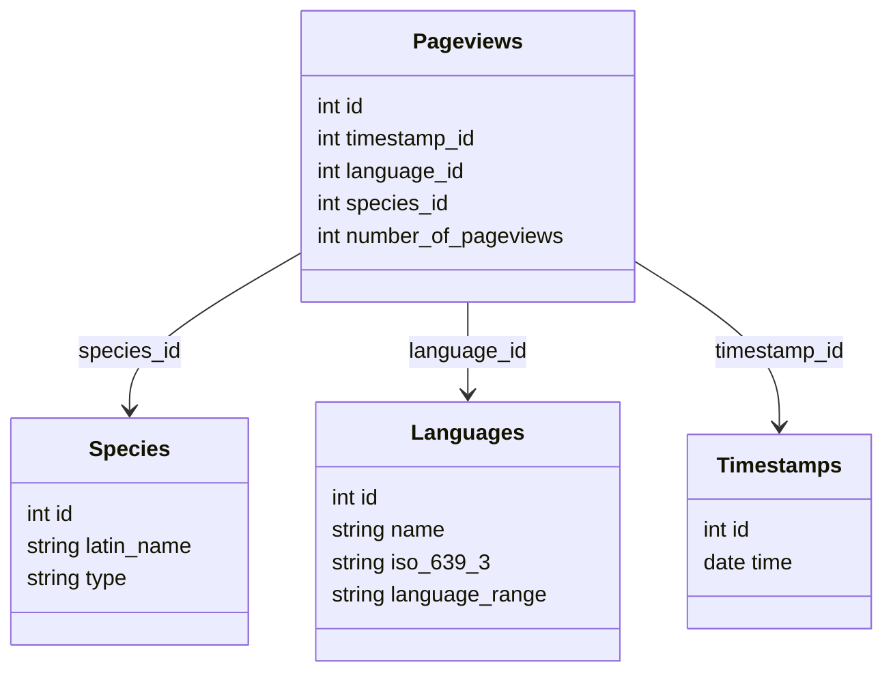

```mermaid
classDiagram
  class Species {
    int id
    string latin_name
    string type
  }
  
  class Languages {
    int id
    string name
    string iso_639_3
    string language_range
  }
  
  class Timestamps {
    int id
    date time
  }
  
  class Pageviews {
    int id
    int timestamp_id
    int language_id
    int species_id
    int number_of_pageviews
  }
  
  Pageviews --> Species : species_id
  Pageviews --> Languages : language_id
  Pageviews --> Timestamps : timestamp_id
```

