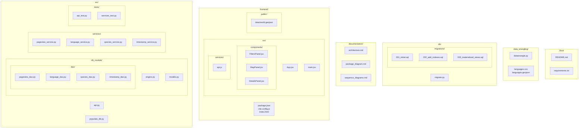

```mermaid
graph TB
  subgraph Root["Root"]
    README["README.md"]
    REQ["requirements.txt"]
  end
  
  subgraph DataWrangling["data_wrangling/"]
    DW1["datawrangle.py"]
    LANG["languages.csv<br/>languages.geojson"]
  end
  
  subgraph DB["db/"]
    MIG["migrate.py"]
    subgraph Migrations["migrations/"]
      M1["001_initial.sql"]
      M2["002_add_indexes.sql"]
      M3["003_materialized_views.sql"]
    end
  end
  
  subgraph Docs["documentation/"]
    ARCH["architecture.md"]
    PKG["package_diagram.md"]
    SEQ["sequence_diagrams.md"]
  end
  
  subgraph Frontend["frontend/"]
    FE1["package.json<br/>vite.config.js<br/>index.html"]
    subgraph FESrc["src/"]
      APP["App.jsx"]
      MAIN["main.jsx"]
      subgraph Components["components/"]
        C1["FiltersPanel.jsx"]
        C2["MapPanel.jsx"]
        C3["DetailsPanel.jsx"]
      end
      subgraph FEServices["services/"]
        API["api.js"]
      end
    end
    subgraph Public["public/"]
      GEOJSON["data/world.geojson"]
    end
  end
  
  subgraph Backend["src/"]
    APIPYTHON["api.py"]
    POPULATE["populate_db.py"]
    subgraph DBModule["db_module/"]
      ENGINE["engine.py"]
      MODELS["models.py"]
      subgraph DAO["dao/"]
        PDAO["pageview_dao.py"]
        LDAO["language_dao.py"]
        SDAO["species_dao.py"]
        TDAO["timestamp_dao.py"]
      end
    end
    subgraph Services["services/"]
      PS["pageview_service.py"]
      LS["language_service.py"]
      SS["species_service.py"]
      TS["timestamp_service.py"]
    end
    subgraph Tests["tests/"]
      ATEST["api_test.py"]
      STEST["services_test.py"]
    end
  end
```
