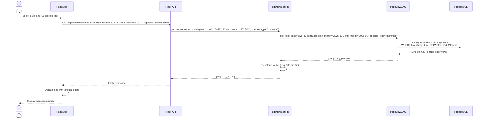
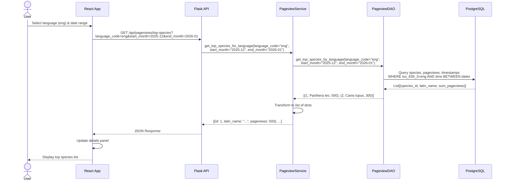

## Get Languages Map Data

```mermaid
sequenceDiagram
  actor User
  participant Frontend as React App
  participant API as Flask API
  participant Service as PageviewService
  participant DAO as PageviewDAO
  participant DB as PostgreSQL

  User->>Frontend: Select date range & species filter
  Frontend->>API: GET /api/languages/map-data?start_month=2025-12&end_month=2026-01&species_type=mammal
  API->>Service: get_languages_map_data(start_month="2025-12", end_month="2026-01", species_type="mammal")
  Service->>DAO: get_total_pageviews_by_language(start_month="2025-12", end_month="2026-01", species_type="mammal")
  DAO->>DB: Query pageviews JOIN languages<br/>WHERE timestamps.time BETWEEN start AND end
  DB-->>DAO: List[(iso_639_3, total_pageviews)]
  DAO-->>Service: [(eng, 300), (fin, 50)]
  Service->>Service: Transform to dict {eng: 300, fin: 50}
  Service-->>API: {eng: 300, fin: 50}
  API-->>Frontend: JSON Response
  Frontend->>Frontend: Update map with language data
  Frontend-->>User: Display map visualization
```

## Get Top Species for Language

```mermaid
sequenceDiagram
  actor User
  participant Frontend as React App
  participant API as Flask API
  participant Service as PageviewService
  participant DAO as PageviewDAO
  participant DB as PostgreSQL

  User->>Frontend: Select language (eng) & date range
  Frontend->>API: GET /api/pageviews/top-species?<br/>language_code=eng&start_month=2025-12&end_month=2026-01
  API->>Service: get_top_species_for_language(language_code="eng",<br/>start_month="2025-12", end_month="2026-01")
  Service->>DAO: get_top_species_by_language(language_code="eng",<br/>start_month="2025-12", end_month="2026-01")
  DAO->>DB: Query species, pageviews, timestamps<br/>WHERE iso_639_3=eng AND time BETWEEN dates
  DB-->>DAO: List[(species_id, latin_name, sum_pageviews)]
  DAO-->>Service: [(1, Panthera leo, 500), (2, Canis lupus, 300)]
  Service->>Service: Transform to list of dicts
  Service-->>API: [{id: 1, latin_name: "...", pageviews: 500}, ...]
  API-->>Frontend: JSON Response
  Frontend->>Frontend: Update details panel
  Frontend-->>User: Display top species list
```
